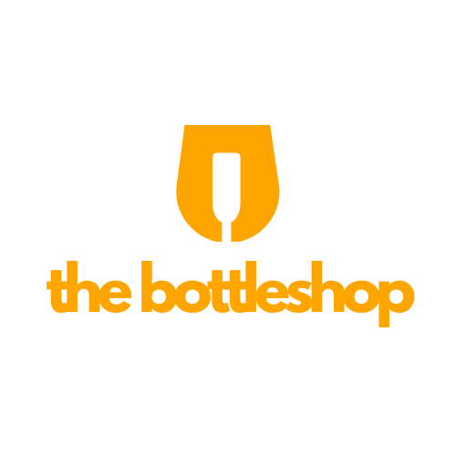

# 🍾 Bottleshop Data Analysis Dashboard

A streamlined, user-friendly dashboard for analyzing sales and inventory data for Bottleshop Zambia's store locations. This app helps you upload, filter, visualize, and export your data — all in your browser.



---

## 🚀 Features

- 📁 Upload CSV or Excel files
- 📊 Interactive charts (Bar, Line, Pie)
- 📌 Grouped data analysis by store, product, or category
- 🔍 Multi-column filtering
- 📈 Summary metrics (e.g., total sales, quantities)
- 📤 Export filtered data as CSV
- 🖼️ Branded sidebar with Bottleshop logo
- 💾 Sample dataset included for demo/testing

---

## 🧰 Technologies

- [Python](https://python.org)
- [Streamlit](https://streamlit.io/)
- [Pandas](https://pandas.pydata.org/)
- [Plotly](https://plotly.com/python/)

---

## 🔧 Setup Instructions

### 1. Clone the Repository

```bash
git clone https://github.com/Emmanuelzux/data-analysis-tool.git
cd data-analysis-tool
```

### 2. Install Dependencies

Make sure you have Python 3.7+ installed.

```bash
pip install -r requirements.txt
```

### 3. Run the App Locally

```bash
streamlit run bottleshop_dashboard/app.py
```

---

## 🌐 Deploy Online (Streamlit Cloud)

1. Push this repo to your GitHub account
2. Go to [https://streamlit.io/cloud](https://streamlit.io/cloud)
3. Click **“New app”**
4. Set the main file path to:

```
bottleshop_dashboard/app.py
```

5. Hit **Deploy** — your app will go live at:

```
https://your-app-name.streamlit.app
```

---

## 📸 Screenshots

| Upload Page | Analysis Page | Export Page |
|-------------|----------------|-------------|
|  |  |  |

---

## 👨‍💼 About

Made with ❤️ for Bottleshop Zambia to empower store-level data decisions across Kitwe, Ndola, and Solwezi.

> Need more features like user logins, advanced filters, or PDF reporting? Let’s build it together.

